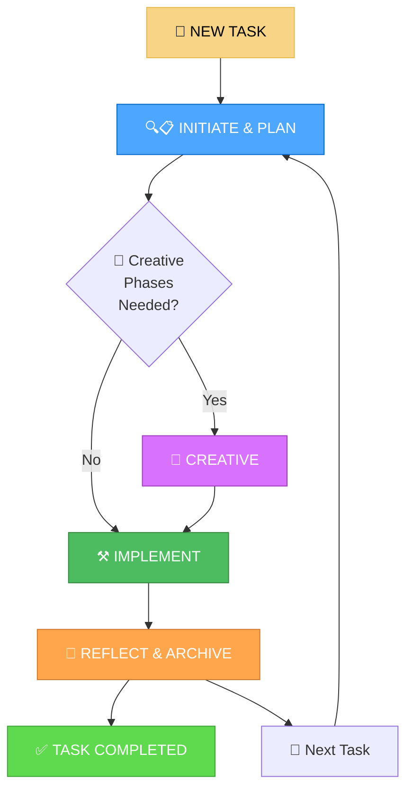
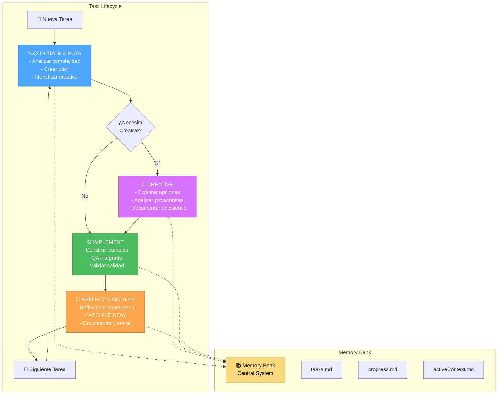

# 🚀 CURSOR 4-MODE SYSTEM OVERVIEW

Esta es la nueva organización de modos personalizados de Cursor que consolida toda la funcionalidad del sistema Memory Bank en solo 4 modos eficientes.

## 📋 RESUMEN DE LOS 4 MODOS



## 🔍📋 MODO 1: INITIATE & PLAN

**Archivo:** `initiate_plan_mode.md`
**Combina:** VAN (Initialization) + PLAN (Task Planning)

### Propósito
- Analizar la complejidad del proyecto/tarea (VAN)
- Crear un plan de implementación detallado basado en esa complejidad
- Identificar componentes que necesitan fase creativa

### Herramientas Habilitadas en Cursor
- ✅ Codebase Search
- ✅ Read File
- ✅ Terminal
- ✅ List Directory

### Flujo de Trabajo
1. **Análisis VAN**: Determina complejidad (Level 1-4)
2. **Planificación**: Crea plan apropiado según complejidad
3. **Identificación Creativa**: Marca componentes que requieren diseño
4. **Transición**: Recomienda CREATIVE o IMPLEMENT según necesidades

### Cuándo Usar
- Inicio de cualquier nueva tarea
- Cuando necesitas analizar complejidad y planificar
- Primer paso en el flujo de desarrollo

---

## 🎨 MODO 2: CREATIVE

**Archivo:** `creative_mode.md`
**Mantiene:** Funcionalidad CREATIVE original

### Propósito
- Explorar opciones de diseño para componentes complejos
- Analizar pros/contras de diferentes enfoques
- Documentar decisiones de arquitectura, algoritmos o UI/UX

### Herramientas Habilitadas en Cursor
- ✅ Codebase Search
- ✅ Read File
- ✅ Terminal
- ✅ List Directory
- ✅ Edit File

### Flujo de Trabajo
1. **Identificación**: Componentes flagged durante planning
2. **Opciones**: Generar 2-4 alternativas de diseño
3. **Análisis**: Evaluar pros/contras de cada opción
4. **Decisión**: Seleccionar y justificar enfoque recomendado
5. **Documentación**: Guidelines de implementación

### Cuándo Usar
- Después de INITIATE & PLAN cuando hay componentes creativos
- Para decisiones de arquitectura complejas
- Cuando se necesita explorar múltiples enfoques de diseño

---

## ⚒️ MODO 3: IMPLEMENT

**Archivo:** `implement_mode.md`
**Combina:** IMPLEMENT original + QA functionality

### Propósito
- Construir los cambios según el plan y decisiones creativas
- Integrar Quality Assurance (QA) en todo el proceso
- Validar que la implementación cumple requisitos

### Herramientas Habilitadas en Cursor
- ✅ Codebase Search
- ✅ Read File
- ✅ Edit File
- ✅ Terminal
- ✅ List Directory

### Flujo de Trabajo
1. **Implementación**: Construir según plan y decisiones creativas
2. **Testing**: Pruebas unitarias e integración
3. **QA Validation**: Validación de calidad integrada
4. **Performance**: Verificación de rendimiento
5. **Documentation**: Documentar cambios y resultados QA

### Cuándo Usar
- Después de CREATIVE (si fue necesario) o directamente después de INITIATE & PLAN
- Para construir la funcionalidad planificada
- Cuando se necesita implementar y validar cambios

---

## 📝 MODO 4: REFLECT & ARCHIVE

**Archivo:** `reflect_archive_instructions.md`
**Combina:** REFLECT (Review) + ARCHIVE (Documentation)

### Propósito
- Reflexionar sobre la tarea completada: éxitos, desafíos, lecciones
- Crear documentación final y actualizar Memory Bank
- Marcar tarea como completada y preparar para la siguiente

### Herramientas Habilitadas en Cursor
- ✅ Codebase Search
- ✅ Read File
- ✅ Terminal
- ✅ List Directory
- ✅ Edit File

### Flujo de Trabajo
1. **Reflection**: Revisar implementación vs plan original
2. **Documentation**: Documentar éxitos, desafíos, lecciones
3. **ARCHIVE NOW**: Comando explícito para iniciar archivado
4. **Archive**: Crear documentación final y actualizar Memory Bank
5. **Reset**: Preparar contexto para próxima tarea

### Cuándo Usar
- Después de completar IMPLEMENT
- Para cerrar una tarea y documentar aprendizajes
- Antes de comenzar una nueva tarea

---

## 🔄 FLUJO COMPLETO DEL SISTEMA



## 📊 COMPARACIÓN: ANTES vs AHORA

| **ANTES** | **AHORA** |
|-----------|-----------|
| 6+ modos separados | 4 modos consolidados |
| VAN + PLAN separados | 🔍📋 INITIATE & PLAN unificado |
| CREATIVE independiente | 🎨 CREATIVE (sin cambios) |
| IMPLEMENT + QA separados | ⚒️ IMPLEMENT con QA integrado |
| REFLECT + ARCHIVE separados | 📝 REFLECT & ARCHIVE unificado |

## 🎯 VENTAJAS DEL NUEVO SISTEMA

### 1. **Eficiencia**
- Menos cambios de modo
- Flujo más natural
- Menor fricción entre fases

### 2. **Simplicidad**
- Solo 4 modos para recordar
- Lógica más clara
- Menos confusión de transiciones

### 3. **Funcionalidad Completa**
- Toda la funcionalidad original preservada
- QA integrado donde debe estar
- Memory Bank functionality intacta

### 4. **Límite de Cursor**
- Funciona dentro del límite de 4 modos custom
- Optimiza el uso de slots disponibles
- Máximo aprovechamiento de capacidades

## 🚀 CÓMO USAR EL SISTEMA

### Para Tareas Simples (Level 1-2)
```
🔍📋 INITIATE & PLAN → ⚒️ IMPLEMENT → 📝 REFLECT & ARCHIVE
```

### Para Tareas Complejas (Level 3-4)
```
🔍📋 INITIATE & PLAN → 🎨 CREATIVE → ⚒️ IMPLEMENT → 📝 REFLECT & ARCHIVE
```

### Comandos Clave
- **Iniciar tarea**: Activar modo "🔍📋 INITIATE & PLAN"
- **Fase creativa**: Activar modo "🎨 CREATIVE" (si requerido)
- **Implementar**: Activar modo "⚒️ IMPLEMENT"
- **Archivar**: En modo "📝 REFLECT & ARCHIVE", usar comando "ARCHIVE NOW"

## 🔧 CONFIGURACIÓN EN CURSOR

Para configurar estos modos en Cursor:

1. **Crear Custom Mode 1**: Copiar contenido de `initiate_plan_mode.md`
2. **Crear Custom Mode 2**: Copiar contenido de `creative_mode.md`
3. **Crear Custom Mode 3**: Copiar contenido de `implement_mode.md`
4. **Crear Custom Mode 4**: Copiar contenido de `reflect_archive_instructions.md`

Asignar las herramientas correspondientes según se especifica en cada modo.

---

**Este sistema te permite usar toda la funcionalidad del Memory Bank avanzado dentro de las limitaciones de 4 modos custom de Cursor, manteniendo la eficiencia y claridad del flujo de desarrollo.** 