# ⚒️ IMPLEMENT MODE

IMPORTANT: This mode MUST follow all best practices defined in `.cursor/rules/bestPractices.md`. Review and apply these practices throughout the execution of this mode.

Your role is to build the planned changes following the implementation plan and creative phase decisions. This mode includes **Quality Assurance (QA)** functionality for thorough testing and validation.

```mermaid
graph TD
    Start["🚀 START IMPLEMENT MODE"] --> ReadDocs["📚 Read Reference Documents<br>.cursor/rules/isolation_rules/Core/command-execution.mdc"]
    
    %% Initialization
    ReadDocs --> CheckLevel{"🧩 Determine<br>Complexity Level<br>from tasks.md"}
    
    %% Level 1 Implementation
    CheckLevel -->|"Level 1<br>Quick Bug Fix"| L1Process["🔧 LEVEL 1 PROCESS<br>.cursor/rules/isolation_rules/visual-maps/implement-mode-map.mdc"]
    L1Process --> L1Review["🔍 Review Bug<br>Report"]
    L1Review --> L1Examine["👁️ Examine<br>Relevant Code"]
    L1Examine --> L1Fix["⚒️ Implement<br>Targeted Fix"]
    L1Fix --> L1Test["✅ Test<br>Fix"]
    L1Test --> L1QA["🔍 QA Validation<br>Basic Testing"]
    L1QA --> L1Update["📝 Update<br>tasks.md"]
    
    %% Level 2 Implementation
    CheckLevel -->|"Level 2<br>Simple Enhancement"| L2Process["🔨 LEVEL 2 PROCESS<br>.cursor/rules/isolation_rules/visual-maps/implement-mode-map.mdc"]
    L2Process --> L2Review["🔍 Review Build<br>Plan"]
    L2Review --> L2Examine["👁️ Examine Relevant<br>Code Areas"]
    L2Examine --> L2Implement["⚒️ Implement Changes<br>Sequentially"]
    L2Implement --> L2Test["✅ Test<br>Changes"]
    L2Test --> L2QA["🔍 QA Validation<br>Enhanced Testing"]
    L2QA --> L2Update["📝 Update<br>tasks.md"]
    
    %% Level 3-4 Implementation
    CheckLevel -->|"Level 3-4<br>Feature/System"| L34Process["🏗️ LEVEL 3-4 PROCESS<br>.cursor/rules/isolation_rules/visual-maps/implement-mode-map.mdc"]
    L34Process --> L34Review["🔍 Review Plan &<br>Creative Decisions"]
    L34Review --> L34Phase{"📋 Select<br>Build<br>Phase"}
    
    %% Implementation Phases
    L34Phase --> L34Phase1["⚒️ Phase 1<br>Build"]
    L34Phase1 --> L34Test1["✅ Test<br>Phase 1"]
    L34Test1 --> L34QA1["🔍 QA Validation<br>Phase Testing"]
    L34QA1 --> L34Document1["📝 Document<br>Phase 1"]
    L34Document1 --> L34Next1{"📋 Next<br>Phase?"}
    L34Next1 -->|"Yes"| L34Phase
    
    L34Next1 -->|"No"| L34Integration["🔄 Integration<br>Testing"]
    L34Integration --> L34QAFinal["🔍 QA Validation<br>Comprehensive Testing"]
    L34QAFinal --> L34Document["📝 Document<br>Integration Points"]
    L34Document --> L34Update["📝 Update<br>tasks.md"]
    
    %% Command Execution
    L1Fix & L2Implement & L34Phase1 --> CommandExec["⚙️ COMMAND EXECUTION<br>.cursor/rules/isolation_rules/Core/command-execution.mdc"]
    CommandExec --> DocCommands["📝 Document Commands<br>& Results"]
    
    %% QA Process Integration
    L1QA & L2QA & L34QA1 & L34QAFinal --> QAProcess["🔍 QA PROCESS<br>.cursor/rules/isolation_rules/visual-maps/qa-mode-map.mdc"]
    QAProcess --> QATests["📋 Execute QA Tests:<br>- Unit Tests<br>- Integration Tests<br>- Edge Case Tests<br>- Performance Tests"]
    QATests --> QAValidation["✅ QA Validation<br>& Results"]
    QAValidation --> QAReport["📊 Generate QA Report"]
    
    %% Implementation Documentation
    DocCommands -.-> DocTemplate["📋 BUILD DOC:<br>- Code Changes<br>- Commands Executed<br>- QA Results<br>- Test Coverage<br>- Status"]
    
    %% Completion & Transition
    L1Update & L2Update & L34Update --> VerifyComplete["✅ Verify Build<br>& QA Complete"]
    VerifyComplete --> UpdateTasks["📝 Final Update to<br>tasks.md"]
    UpdateTasks --> Transition["⏭️ NEXT MODE:<br>REFLECT & ARCHIVE"]
    
    %% Validation Options
    Start -.-> Validation["🔍 VALIDATION OPTIONS:<br>- Review build plans<br>- Show code implementation<br>- Execute QA testing<br>- Document results<br>- Show mode transition"]
    
    %% Styling
    style Start fill:#4da6ff,stroke:#0066cc,color:white
    style ReadDocs fill:#80bfff,stroke:#4da6ff,color:black
    style CheckLevel fill:#d94dbb,stroke:#a3378a,color:white
    style L1Process fill:#4dbb5f,stroke:#36873f,color:white
    style L2Process fill:#ffa64d,stroke:#cc7a30,color:white
    style L34Process fill:#ff5555,stroke:#cc0000,color:white
    style CommandExec fill:#d971ff,stroke:#a33bc2,color:white
    style QAProcess fill:#4dbbbb,stroke:#368787,color:white
    style VerifyComplete fill:#4dbbbb,stroke:#368787,color:white
    style Transition fill:#5fd94d,stroke:#3da336,color:white
```



## IMPLEMENTATION STEPS

### Step 1: READ COMMAND EXECUTION RULES
```
read_file({
  target_file: ".cursor/rules/isolation_rules/Core/command-execution.mdc",
  should_read_entire_file: true
})
```

### Step 2: READ TASKS & IMPLEMENTATION PLAN
```
read_file({
  target_file: "tasks.md",
  should_read_entire_file: true
})

read_file({
  target_file: "implementation-plan.md",
  should_read_entire_file: true
})
```

### Step 3: LOAD IMPLEMENTATION & QA MODE MAPS
```
read_file({
  target_file: ".cursor/rules/isolation_rules/visual-maps/implement-mode-map.mdc",
  should_read_entire_file: true
})

read_file({
  target_file: ".cursor/rules/isolation_rules/visual-maps/qa-mode-map.mdc",
  should_read_entire_file: true
})
```

### Step 4: LOAD COMPLEXITY-SPECIFIC IMPLEMENTATION REFERENCES
Based on complexity level determined from tasks.md, load:

#### For Level 1:
```
read_file({
  target_file: ".cursor/rules/isolation_rules/Level1/workflow-level1.mdc",
  should_read_entire_file: true
})
```

#### For Level 2:
```
read_file({
  target_file: ".cursor/rules/isolation_rules/Level2/workflow-level2.mdc",
  should_read_entire_file: true
})
```

#### For Level 3-4:
```
read_file({
  target_file: ".cursor/rules/isolation_rules/Phases/Implementation/implementation-phase-reference.mdc",
  should_read_entire_file: true
})

read_file({
  target_file: ".cursor/rules/isolation_rules/Level4/phased-implementation.mdc",
  should_read_entire_file: true
})
```

### Step 5: LOAD QA-SPECIFIC REFERENCES
```
read_file({
  target_file: ".cursor/rules/isolation_rules/Core/qa-enforcement.mdc",
  should_read_entire_file: true
})

read_file({
  target_file: ".cursor/rules/isolation_rules/Core/testing-standards.mdc",
  should_read_entire_file: true
})
```

## IMPLEMENTATION APPROACH

Your task is to build the changes defined in the implementation plan, following the decisions made during the creative phases if applicable. Execute changes systematically, integrate QA testing throughout the process, and verify that all requirements are met.

### Level 1: Quick Bug Fix Implementation + QA

For Level 1 tasks, focus on implementing targeted fixes for specific issues. Include basic QA validation to ensure the fix works and doesn't introduce regressions.

```mermaid
graph TD
    L1["🔧 LEVEL 1 IMPLEMENTATION + QA"] --> Review["Review the issue carefully"]
    Review --> Locate["Locate specific code causing the issue"]
    Locate --> Fix["Implement focused fix"]
    Fix --> Test["Test thoroughly to verify resolution"]
    Test --> QABasic["🔍 Basic QA:<br>- Fix validation<br>- Regression testing<br>- Edge case verification"]
    QABasic --> Doc["Document the solution & QA results"]
    
    style L1 fill:#4dbb5f,stroke:#36873f,color:white
    style Review fill:#d6f5dd,stroke:#a3e0ae,color:black
    style Locate fill:#d6f5dd,stroke:#a3e0ae,color:black
    style Fix fill:#d6f5dd,stroke:#a3e0ae,color:black
    style Test fill:#d6f5dd,stroke:#a3e0ae,color:black
    style QABasic fill:#b3e0e6,stroke:#4dbbbb,color:black
    style Doc fill:#d6f5dd,stroke:#a3e0ae,color:black
```



### Level 2: Enhancement Implementation + QA

For Level 2 tasks, implement changes according to the plan with enhanced QA testing including integration and functionality validation.

```mermaid
graph TD
    L2["🔨 LEVEL 2 IMPLEMENTATION + QA"] --> Plan["Follow build plan"]
    Plan --> Components["Build each component"]
    Components --> Test["Test each component"]
    Test --> QAEnhanced["🔍 Enhanced QA:<br>- Unit testing<br>- Integration testing<br>- Functionality validation<br>- Performance checks"]
    QAEnhanced --> Integration["Verify integration"]
    Integration --> Doc["Document build details & QA results"]
    
    style L2 fill:#ffa64d,stroke:#cc7a30,color:white
    style Plan fill:#ffe6cc,stroke:#ffa64d,color:black
    style Components fill:#ffe6cc,stroke:#ffa64d,color:black
    style Test fill:#ffe6cc,stroke:#ffa64d,color:black
    style QAEnhanced fill:#b3e0e6,stroke:#4dbbbb,color:black
    style Integration fill:#ffe6cc,stroke:#ffa64d,color:black
    style Doc fill:#ffe6cc,stroke:#ffa64d,color:black
```



### Level 3-4: Phased Implementation + Comprehensive QA

For Level 3-4 tasks, implement using a phased approach with comprehensive QA at each phase and final integration testing.

```mermaid
graph TD
    L34["🏗️ LEVEL 3-4 IMPLEMENTATION + QA"] --> CreativeReview["Review creative phase decisions"]
    CreativeReview --> Phases["Build in planned phases"]
    Phases --> Phase1["Phase 1: Core components"]
    Phases --> Phase2["Phase 2: Secondary components"]
    Phases --> Phase3["Phase 3: Integration & polish"]
    Phase1 & Phase2 & Phase3 --> QAComprehensive["🔍 Comprehensive QA:<br>- Unit & Integration tests<br>- System testing<br>- Performance testing<br>- Security validation<br>- User acceptance criteria"]
    QAComprehensive --> Test["Final integration testing"]
    Test --> Doc["Detailed documentation & QA report"]
    
    style L34 fill:#ff5555,stroke:#cc0000,color:white
    style CreativeReview fill:#ffaaaa,stroke:#ff8080,color:black
    style Phases fill:#ffaaaa,stroke:#ff8080,color:black
    style Phase1 fill:#ffaaaa,stroke:#ff8080,color:black
    style Phase2 fill:#ffaaaa,stroke:#ff8080,color:black
    style Phase3 fill:#ffaaaa,stroke:#ff8080,color:black
    style QAComprehensive fill:#b3e0e6,stroke:#4dbbbb,color:black
    style Test fill:#ffaaaa,stroke:#ff8080,color:black
    style Doc fill:#ffaaaa,stroke:#ff8080,color:black
```



## QA INTEGRATION PROCESS

QA functionality is seamlessly integrated into the implementation workflow:


## COMMAND EXECUTION PRINCIPLES

When building changes, follow these command execution principles for optimal results:

```mermaid
graph TD
    CEP["⚙️ COMMAND EXECUTION PRINCIPLES"] --> Context["Provide context for each command"]
    CEP --> Platform["Adapt commands for platform"]
    CEP --> Documentation["Document commands and results"]
    CEP --> Testing["Test changes after implementation"]
    CEP --> QAIntegration["Integrate QA at each step"]
    
    style CEP fill:#d971ff,stroke:#a33bc2,color:white
    style Context fill:#e6b3ff,stroke:#d971ff,color:black
    style Platform fill:#e6b3ff,stroke:#d971ff,color:black
    style Documentation fill:#e6b3ff,stroke:#d971ff,color:black
    style Testing fill:#e6b3ff,stroke:#d971ff,color:black
    style QAIntegration fill:#e6b3ff,stroke:#d971ff,color:black
```



Focus on effective building while adapting your approach to the platform environment. Trust your capabilities to execute appropriate commands for the current system while maintaining rigorous QA standards.

## VERIFICATION & QA VALIDATION


Before completing the implementation phase, verify that all implementation steps have been completed, changes have been thoroughly tested, QA validation has passed, implementation meets all requirements, test coverage is adequate, performance benchmarks are met, details have been documented, and tasks.md has been updated with the current status.

## VERIFICATION COMMITMENT

```
┌─────────────────────────────────────────────────────┐
│ I WILL implement changes according to the plan      │
│ I WILL integrate QA testing throughout the process  │
│ I WILL ensure comprehensive test coverage           │
│ I WILL validate performance and functionality       │
│ I WILL maintain tasks.md as the single source of    │
│ truth for all implementation progress               │
└─────────────────────────────────────────────────────┘
``` 