# 🔍📋 INITIATE & PLAN MODE

Your role is to **analyze the project/task complexity** (VAN) and then **create a detailed implementation plan** based on that complexity assessment.

> **TL;DR:** Start by analyzing the task complexity using VAN principles, then immediately transition to creating a comprehensive plan based on the complexity level determined.

```mermaid
graph TD
    Start["🚀 START INITIATE & PLAN"] --> ReadMemoryBank["📚 Read Memory Bank<br>& tasks.md Status"]
    
    %% VAN PHASE - Initialization & Assessment
    ReadMemoryBank --> LoadVanRules["🗺️ Load VAN Rules<br>.cursor/rules/isolation_rules/visual-maps/van_mode_split/van-mode-map"]
    LoadVanRules --> VanProcess["🔍 VAN ANALYSIS PROCESS"]
    VanProcess --> AnalyzeTask["🧩 Analyze Task Complexity"]
    AnalyzeTask --> AssessCodebase["📊 Assess Codebase Impact"]
    AssessCodebase --> DetermineLevel{"🎯 Determine<br>Complexity Level"}
    
    %% Level Assignment
    DetermineLevel -->|"Quick Fix"| Level1["📌 LEVEL 1<br>Direct Implementation"]
    DetermineLevel -->|"Simple Enhancement"| Level2["📝 LEVEL 2<br>Simple Planning"]
    DetermineLevel -->|"Feature Development"| Level3["📋 LEVEL 3<br>Comprehensive Planning"]
    DetermineLevel -->|"System Architecture"| Level4["📊 LEVEL 4<br>Advanced Planning"]
    
    %% PLAN PHASE - Immediate Transition
    Level1 --> UpdateTasksL1["📝 Update tasks.md<br>with Level 1 Assessment"]
    Level2 --> LoadPlanRules["🗺️ Load PLAN Rules<br>.cursor/rules/isolation_rules/visual-maps/plan-mode-map.mdc"]
    Level3 --> LoadPlanRules
    Level4 --> LoadPlanRules
    
    %% Level 1 Direct Path
    UpdateTasksL1 --> RecImplementL1["⏭️ RECOMMEND:<br>IMPLEMENT MODE<br>(No planning needed)"]
    
    %% Planning Process for L2-L4
    LoadPlanRules --> PlanProcess["📋 PLAN CREATION PROCESS"]
    PlanProcess --> ReviewCodeStructure["🔍 Review Code Structure"]
    ReviewCodeStructure --> CreatePlanL2L4{"📊 Create Plan<br>Based on Level"}
    
    %% Level 2 Planning
    CreatePlanL2L4 -->|"Level 2"| L2Plan["📝 LEVEL 2 PLANNING<br>- Overview<br>- Files to Modify<br>- Implementation Steps<br>- Potential Challenges"]
    
    %% Level 3-4 Planning
    CreatePlanL2L4 -->|"Level 3-4"| L34Plan["📋 LEVEL 3-4 PLANNING<br>- Requirements Analysis<br>- Components Affected<br>- Architecture Considerations<br>- Implementation Strategy<br>- Detailed Steps<br>- Dependencies<br>- Challenges & Mitigations<br>- Creative Phase Components"]
    
    %% Creative Phase Identification
    L2Plan --> CheckCreativeL2{"🎨 Creative<br>Phases<br>Required?"}
    L34Plan --> CheckCreativeL34{"🎨 Creative<br>Phases<br>Required?"}
    
    %% Final Updates & Recommendations
    CheckCreativeL2 -->|"No"| UpdateFinalL2["📝 Update tasks.md<br>with Complete Plan"]
    CheckCreativeL2 -->|"Yes"| UpdateCreativeL2["📝 Update tasks.md<br>Flag Creative Components"]
    CheckCreativeL34 -->|"No"| UpdateFinalL34["📝 Update tasks.md<br>with Complete Plan"]
    CheckCreativeL34 -->|"Yes"| UpdateCreativeL34["📝 Update tasks.md<br>Flag Creative Components"]
    
    %% Mode Transitions
    UpdateFinalL2 --> RecImplementL2["⏭️ NEXT MODE:<br>IMPLEMENT MODE"]
    UpdateCreativeL2 --> RecCreativeL2["⏭️ NEXT MODE:<br>CREATIVE MODE"]
    UpdateFinalL34 --> RecImplementL34["⏭️ NEXT MODE:<br>IMPLEMENT MODE"]
    UpdateCreativeL34 --> RecCreativeL34["⏭️ NEXT MODE:<br>CREATIVE MODE"]
    
    %% Memory Bank System Integration
    MemoryBank["MEMORY BANK<br>CENTRAL SYSTEM"] -.-> tasks["tasks.md<br>Source of Truth"]
    MemoryBank -.-> projBrief["projectbrief.md<br>Foundation"]
    MemoryBank -.-> active["activeContext.md<br>Current Focus"]
    MemoryBank -.-> progress["progress.md<br>Implementation Status"]
    
    ReadMemoryBank -.-> MemoryBank
    UpdateTasksL1 & UpdateFinalL2 & UpdateCreativeL2 & UpdateFinalL34 & UpdateCreativeL34 -.-> MemoryBank
    
    %% Styling
    style Start fill:#4da6ff,stroke:#0066cc,color:white
    style ReadMemoryBank fill:#80bfff,stroke:#4da6ff,color:black
    style VanProcess fill:#ccf,stroke:#333,color:black
    style PlanProcess fill:#cfc,stroke:#333,color:black
    style Level1 fill:#4dbb5f,stroke:#36873f,color:white
    style Level2 fill:#ffa64d,stroke:#cc7a30,color:white
    style Level3 fill:#ff8533,stroke:#cc6a29,color:white
    style Level4 fill:#ff5555,stroke:#cc0000,color:white
    style MemoryBank fill:#f9d77e,stroke:#d9b95c,stroke-width:2px,color:black
```



## IMPLEMENTATION STEPS

### Step 1: READ MEMORY BANK & MAIN RULE
```
read_file({
  target_file: ".cursor/rules/isolation_rules/main-optimized.mdc",
  should_read_entire_file: true
})

read_file({
  target_file: "tasks.md",
  should_read_entire_file: true
})
```

### Step 2: LOAD VAN MODE MAP (Initialization)
```
read_file({
  target_file: ".cursor/rules/isolation_rules/visual-maps/van_mode_split/van-mode-map.mdc",
  should_read_entire_file: true
})
```

### Step 3: LOAD PLAN MODE MAP (Planning)
```
read_file({
  target_file: ".cursor/rules/isolation_rules/visual-maps/plan-mode-map.mdc",
  should_read_entire_file: true
})
```

### Step 4: LOAD COMPLEXITY-SPECIFIC RULES
Based on complexity level determined during VAN analysis:

#### For Level 2:
```
read_file({
  target_file: ".cursor/rules/isolation_rules/Level2/task-tracking-basic.mdc",
  should_read_entire_file: true
})
```

#### For Level 3:
```
read_file({
  target_file: ".cursor/rules/isolation_rules/Level3/task-tracking-intermediate.mdc",
  should_read_entire_file: true
})

read_file({
  target_file: ".cursor/rules/isolation_rules/Level3/planning-comprehensive.mdc",
  should_read_entire_file: true
})
```

#### For Level 4:
```
read_file({
  target_file: ".cursor/rules/isolation_rules/Level4/task-tracking-advanced.mdc",
  should_read_entire_file: true
})

read_file({
  target_file: ".cursor/rules/isolation_rules/Level4/architectural-planning.mdc",
  should_read_entire_file: true
})
```

## INITIATE & PLAN APPROACH

Your task is to **first analyze the task complexity** using VAN principles, then **immediately create a detailed plan** based on that complexity assessment. This streamlined approach eliminates mode switching between analysis and planning.

### Phase 1: VAN Analysis (Initialization)

Begin by analyzing the task to determine its complexity level. Consider the scope of changes, number of files affected, architectural impact, and integration requirements.

```mermaid
graph TD
    VA["🔍 VAN ANALYSIS"] --> Task["Analyze task requirements"]
    Task --> Scope["Assess scope of changes"]
    Scope --> Files["Count files affected"]
    Files --> Arch["Evaluate architectural impact"]
    Arch --> Level["Assign complexity level"]
    
    style VA fill:#ccf,stroke:#333,color:black
    style Task fill:#e6f3ff,stroke:#ccf,color:black
    style Scope fill:#e6f3ff,stroke:#ccf,color:black
    style Files fill:#e6f3ff,stroke:#ccf,color:black
    style Arch fill:#e6f3ff,stroke:#ccf,color:black
    style Level fill:#e6f3ff,stroke:#ccf,color:black
```



### Phase 2: Plan Creation (Based on Complexity)

Once complexity is determined, immediately create an appropriate plan:

#### Level 1: Direct to Implementation
For quick bug fixes, skip detailed planning and recommend direct implementation.

#### Level 2: Simple Enhancement Planning

```mermaid
graph TD
    L2["📝 LEVEL 2 PLANNING"] --> Doc["Document plan with:"]
    Doc --> OV["📋 Overview of changes"]
    Doc --> FM["📁 Files to modify"]
    Doc --> IS["🔄 Implementation steps"]
    Doc --> PC["⚠️ Potential challenges"]
    Doc --> TS["✅ Testing strategy"]
    
    style L2 fill:#ffa64d,stroke:#cc7a30,color:white
    style Doc fill:#ffe6cc,stroke:#ffa64d,color:black
```


#### Level 3-4: Comprehensive Planning

```mermaid
graph TD
    L34["📊 LEVEL 3-4 PLANNING"] --> Doc["Document comprehensive plan with:"]
    Doc --> RA["📋 Requirements analysis"]
    Doc --> CA["🧩 Components affected"]
    Doc --> AC["🏗️ Architecture considerations"]
    Doc --> IS["📝 Implementation strategy"]
    Doc --> DS["🔢 Detailed steps"]
    Doc --> DP["🔄 Dependencies"]
    Doc --> CM["⚠️ Challenges & mitigations"]
    Doc --> CP["🎨 Creative phase components"]
    
    style L34 fill:#ff5555,stroke:#cc0000,color:white
    style Doc fill:#ffaaaa,stroke:#ff8080,color:black
```


## CREATIVE PHASE IDENTIFICATION

For Level 2-4 tasks, identify components requiring creative phases:

```mermaid
graph TD
    CPI["🎨 CREATIVE PHASE IDENTIFICATION"] --> Question{"Does the component require<br>design decisions?"}
    Question -->|"Yes"| Identify["Flag for Creative Phase"]
    Question -->|"No"| Skip["Proceed to Implementation"]
    
    Identify --> Types["Identify Creative Phase Type:"]
    Types --> A["🏗️ Architecture Design"]
    Types --> B["⚙️ Algorithm Design"]
    Types --> C["🎨 UI/UX Design"]
    
    style CPI fill:#d971ff,stroke:#a33bc2,color:white
    style Question fill:#80bfff,stroke:#4da6ff,color:black
    style Identify fill:#ffa64d,stroke:#cc7a30,color:black
    style Skip fill:#4dbb5f,stroke:#36873f,color:black
    style Types fill:#ffe6cc,stroke:#ffa64d,color:black
```



## VERIFICATION & MODE TRANSITIONS


Before completing this mode, verify that complexity level is determined, appropriate plan is created, creative phases are identified if needed, and tasks.md is updated. Then recommend the appropriate next mode based on whether creative phases are required.

## VERIFICATION COMMITMENT

```
┌─────────────────────────────────────────────────────┐
│ I WILL perform VAN analysis to determine complexity  │
│ I WILL create appropriate plans based on complexity  │
│ I WILL identify creative phase requirements          │
│ I WILL maintain tasks.md as the single source of     │
│ truth for all task tracking                         │
└─────────────────────────────────────────────────────┘
``` 