# uDance - Comprehensive Database Schema

This document outlines the database schema for the uDance platform, synthesizing all functional requirements from user stories and visual data points from mockups into a single, coherent model.

## Entity-Relationship Diagram (ERD)

```mermaid
erDiagram
    users ||--o{ user_roles : "has"
    users ||--o{ user_profiles : "has"
    users ||--o{ instructor_profiles : "can be"
    users ||--o{ bookings : "makes"
    users ||--o{ reviews : "writes"
    users ||--o{ comments : "writes"
    users ||--o{ likes : "gives"
    users ||--o{ favorites : "has"
    users ||--o{ user_connections : "connects with"
    users ||--o{ news : "authors"
    users ||--o{ content_reports : "reports"
    users ||--o{ tickets : "holds"
    users ||--o{ admin_action_logs : "performs"
    users ||--o{ platform_announcements : "authors"

    roles ||--o{ user_roles : "defines"
    roles ||--o{ role_permissions : "has"
    permissions ||--o{ role_permissions : "is granted to"

    studios ||--o{ classes : "hosts"
    studios ||--o{ events : "hosts"
    studios ||--o{ reviews : "is reviewed on"
    studios ||--o{ taggables : "can be tagged"
    studios ||--o{ studio_agreements : "has"

    classes ||--o{ class_schedules : "has"
    classes ||--o{ bookings : "is booked for"
    classes ||--o{ reviews : "is reviewed on"
    classes ||--o{ class_instructors : "is taught by"

    events ||--o{ bookings : "is booked for"
    events ||--o{ reviews : "is reviewed on"
    events ||--o{ event_instructors : "is taught by"
    events ||--o{ event_sellers : "is sold by"
    events ||--o{ taggables : "can be tagged"
    events ||--o{ tickets : "has"
    events ||--o{ event_dance_styles : "has style"
    event_categories ||--o{ events : "are categorized by"

    instructor_profiles ||--o{ class_instructors : "teaches"
    instructor_profiles ||--o{ event_instructors : "teaches"
    instructor_profiles ||--o{ reviews : "is reviewed on"
    instructor_profiles ||--o{ instructor_dance_styles : "specializes in"

    news ||--o{ comments : "has"
    news ||--o{ likes : "has"

    tags ||--o{ taggables : "is used in"
    dance_styles ||--o{ event_dance_styles : "is style for"
    dance_styles ||--o{ instructor_dance_styles : "is style for"

    user_profiles {
        uuid id PK
        uuid user_id FK
        varchar first_name
        varchar last_name
        text bio
        varchar avatar_url
        date date_of_birth
        varchar phone_number
    }

    instructor_profiles {
        uuid id PK
        uuid user_id FK
        text bio
        integer years_of_experience
        jsonb stats
    }

    users {
        uuid id PK
        varchar email
        varchar password_hash
        timestamp created_at
    }

    roles {
        serial id PK
        varchar name UK
        text description
    }

    user_roles {
        uuid user_id PK, FK
        integer role_id PK, FK
    }

    permissions {
        serial id PK
        varchar name UK
        text description
    }

    role_permissions {
        integer role_id PK, FK
        integer permission_id PK, FK
    }

    studios {
        uuid id PK
        varchar name
        text description
        varchar address
        varchar city
        varchar country
        decimal latitude
        decimal longitude
        varchar phone_number
        varchar email
        varchar website_url
        varchar image_url
        jsonb stats
        uuid created_by FK
    }

    classes {
        uuid id PK
        uuid studio_id FK
        varchar name
        text description
        varchar level
        integer duration_minutes
    }

    class_schedules {
        uuid id PK
        uuid class_id FK
        timestamp start_time
        timestamp end_time
        integer capacity
        decimal price
        boolean is_recurring
    }

    events {
        uuid id PK
        uuid studio_id FK
        uuid category_id FK
        varchar title
        text description
        varchar image_url
        timestamp start_date
        timestamp end_date
        decimal price
        integer capacity
        uuid created_by FK
    }

    bookings {
        uuid id PK
        uuid user_id FK
        uuid bookable_id
        varchar bookable_type
        varchar status
        decimal amount_paid
    }

    reviews {
        uuid id PK
        uuid user_id FK
        uuid reviewable_id
        varchar reviewable_type
        integer rating
        text content
    }

    comments {
        uuid id PK
        uuid user_id FK
        uuid commentable_id
        varchar commentable_type
        text content
        uuid parent_comment_id FK
    }

    likes {
        uuid user_id PK, FK
        uuid likeable_id PK
        varchar likeable_type PK
    }

    favorites {
        uuid user_id PK, FK
        uuid favoritable_id PK
        varchar favoritable_type PK
    }

    news {
        uuid id PK
        uuid author_id FK
        varchar title
        text content
        varchar image_url
        timestamp published_at
    }

    user_connections {
        uuid user_id_1 PK, FK
        uuid user_id_2 PK, FK
        varchar status
    }

    tags {
        serial id PK
        varchar name UK
    }

    taggables {
        integer tag_id PK, FK
        uuid taggable_id PK
        varchar taggable_type PK
    }

    class_instructors {
        uuid class_schedule_id PK, FK
        uuid instructor_id PK, FK
    }

    event_instructors {
        uuid event_id PK, FK
        uuid instructor_id PK, FK
    }

    event_sellers {
        uuid event_id PK, FK
        uuid seller_id PK, FK
    }

    content_reports {
        uuid id PK
        uuid reporter_user_id FK
        uuid reportable_id
        varchar reportable_type
        text reason
        varchar status
        timestamp created_at
    }

    tickets {
        uuid id PK
        uuid user_id FK
        uuid event_id FK
        uuid seller_user_id FK
        varchar qr_code_identifier UK
        varchar status
        timestamp created_at
    }

    manual_payments {
        uuid id PK
        uuid debtor_id
        varchar debtor_type
        decimal amount
        varchar currency
        date due_date
        varchar status
        text description
        timestamp created_at
    }

    studio_agreements {
        uuid id PK
        uuid studio_id FK
        decimal fee_amount
        varchar fee_type
        varchar billing_cycle
        date start_date
        date end_date
        timestamp created_at
    }

    admin_action_logs {
        uuid id PK
        uuid admin_user_id FK
        varchar action_type
        uuid target_entity_id
        varchar target_entity_type
        jsonb details
        timestamp created_at
    }

    platform_announcements {
        uuid id PK
        uuid author_id FK
        varchar title
        text content
        varchar status
        timestamp published_at
        timestamp expires_at
    }

    dance_styles {
        serial id PK
        varchar name UK
        text description
    }

    event_categories {
        serial id PK
        varchar name UK
        text description
    }

    event_dance_styles {
        uuid event_id PK, FK
        integer dance_style_id PK, FK
    }

    instructor_dance_styles {
        uuid instructor_profile_id PK, FK
        integer dance_style_id PK, FK
    }
```

## 1. Core & User Management

#### `users`

Stores core authentication credentials for every individual on the platform.

- `id` (PK, UUID): Unique identifier for the user.
- `email` (VARCHAR, UNIQUE): User's email address, used for login.
- `password_hash` (VARCHAR): Hashed password for security.
- `created_at` (TIMESTAMP): Timestamp of account creation.

#### `roles`

Defines the distinct roles a user can have (e.g., Student, Instructor, Studio Admin).

- `id` (PK, SERIAL): Unique identifier for the role.
- `name` (VARCHAR, UNIQUE): Name of the role (e.g., 'student', 'instructor', 'studio_admin', 'event_organizer', 'platform_admin').
- `description` (TEXT): A brief description of the role's purpose.

#### `user_roles`

A join table linking users to their roles. A user can have multiple roles.

- `user_id` (PK, FK to `users.id`): The user's ID.
- `role_id` (PK, FK to `roles.id`): The role's ID.

#### `permissions`

Defines granular permissions that can be assigned to roles.

- `id` (PK, SERIAL): Unique identifier for the permission.
- `name` (VARCHAR, UNIQUE): The name of the permission (e.g., 'delete_user', 'manage_taxonomy', 'publish_announcements').
- `description` (TEXT): A brief explanation of what the permission allows.

#### `role_permissions`

A join table linking roles to their granted permissions.

- `role_id` (PK, FK to `roles.id`): The role's ID.
- `permission_id` (PK, FK to `permissions.id`): The permission's ID.

#### `user_profiles`

Stores general, non-authentication information about a user.

- `id` (PK, UUID): Unique identifier for the profile.
- `user_id` (FK to `users.id`, UNIQUE): Links to the authentication entry.
- `first_name` (VARCHAR): User's first name.
- `last_name` (VARCHAR): User's last name.
- `bio` (TEXT): A short biography.
- `avatar_url` (VARCHAR): URL to the user's profile picture.
- `date_of_birth` (DATE): User's date of birth.
- `phone_number` (VARCHAR): User's contact phone number.

#### `instructor_profiles`

Stores specialized information for users with the 'instructor' role.

- `id` (PK, UUID): Unique identifier for the instructor profile.
- `user_id` (FK to `users.id`, UNIQUE): Links to the user account.
- `bio` (TEXT): A professional biography for the instructor.
- `years_of_experience` (INTEGER): Number of years of teaching experience.
- `stats` (JSONB): Flexible field for stats like 'students taught' or 'classes this week'.

## 2. Places & Events

#### `studios` (Places)

Represents a physical location or studio that hosts classes and events.

- `id` (PK, UUID): Unique identifier for the studio.
- `name` (VARCHAR): The studio's name.
- `description` (TEXT): Detailed description of the studio.
- `address`, `city`, `country` (VARCHAR): Location details.
- `latitude`, `longitude` (DECIMAL): Geographic coordinates for mapping.
- `phone_number`, `email`, `website_url` (VARCHAR): Contact information.
- `image_url` (VARCHAR): URL for the studio's main image.
- `stats` (JSONB): Flexible field for stats like 'weekly classes' or 'active students'.
- `created_by` (FK to `users.id`): The user (Studio Admin) who created the profile.

#### `events`

Represents a specific, time-bound event like a workshop, party, or special class.

- `id` (PK, UUID): Unique identifier for the event.
- `studio_id` (FK to `studios.id`, nullable): The studio hosting the event, if any.
- `title` (VARCHAR): The event's title.
- `category_id` (FK to `event_categories.id`): The category of the event (e.g., Workshop, Social).
- `description` (TEXT): Detailed description of the event.
- `image_url` (VARCHAR): URL for the event's promotional image.
- `start_date`, `end_date` (TIMESTAMP): Start and end times for the event.
- `price` (DECIMAL): Cost to attend the event.
- `capacity` (INTEGER): Maximum number of attendees.
- `created_by` (FK to `users.id`): The user (Event Organizer) who created the event.

#### `classes`

Defines a template for a class (e.g., "Advanced Salsa"). The actual occurrences are scheduled.

- `id` (PK, UUID): Unique identifier for the class definition.
- `studio_id` (FK to `studios.id`): The studio that offers this class.
- `name` (VARCHAR): Name of the class.
- `description` (TEXT): Description of what the class covers.
- `level` (VARCHAR): Difficulty level (e.g., 'Beginner', 'Intermediate', 'Advanced').
- `duration_minutes` (INTEGER): The length of one class session.

#### `class_schedules`

Represents a specific, bookable instance or recurring schedule of a class.

- `id` (PK, UUID): Unique identifier for the schedule entry.
- `class_id` (FK to `classes.id`): The class being scheduled.
- `start_time`, `end_time` (TIMESTAMP): The exact start and end time of the class instance.
- `capacity` (INTEGER): Maximum number of students for this specific class.
- `price` (DECIMAL): Price for this specific class.
- `is_recurring` (BOOLEAN): Flag for recurring schedules (e.g., every Tuesday).

## 3. User Interaction & Social Features

#### `bookings`

Tracks a user's registration for a class or event.

- `id` (PK, UUID): Unique identifier for the booking.
- `user_id` (FK to `users.id`): The user who made the booking.
- `bookable_id` (UUID): The ID of the item being booked.
- `bookable_type` (VARCHAR): The type of item ('class_schedule', 'event').
- `status` (VARCHAR): e.g., 'confirmed', 'cancelled', 'waitlisted'.
- `amount_paid` (DECIMAL): The amount paid for the booking.

#### `reviews`

A polymorphic table for user-submitted ratings and comments on various entities.

- `id` (PK, UUID): Unique identifier for the review.
- `user_id` (FK to `users.id`): The author of the review.
- `reviewable_id` (UUID): The ID of the item being reviewed.
- `reviewable_type` (VARCHAR): The type of item ('studio', 'event', 'instructor_profile', 'class').
- `rating` (INTEGER): A rating from 1 to 5.
- `content` (TEXT): The text of the review.

#### `news`

Stores articles, blog posts, or announcements.

- `id` (PK, UUID): Unique identifier for the news article.
- `author_id` (FK to `users.id`): The user who wrote the article.
- `title` (VARCHAR): The article's title.
- `content` (TEXT): The main body of the article.
- `image_url` (VARCHAR): URL for a feature image.
- `published_at` (TIMESTAMP): When the article was made public.

#### `comments`

A polymorphic table for comments on news articles or other commentable entities.

- `id` (PK, UUID): Unique identifier for the comment.
- `user_id` (FK to `users.id`): The author of the comment.
- `commentable_id` (UUID): The ID of the item being commented on.
- `commentable_type` (VARCHAR): The type of item ('news', 'event').
- `content` (TEXT): The text of the comment.
- `parent_comment_id` (FK to `comments.id`, nullable): For threaded replies.

#### `likes`

A polymorphic join table to track user likes on entities like news articles.

- `user_id` (PK, FK to `users.id`): The user who gave the like.
- `likeable_id` (PK, UUID): The ID of the item being liked.
- `likeable_type` (PK, VARCHAR): The type of item ('news', 'comment').

#### `favorites`

A polymorphic join table for users to mark entities as favorites.

- `user_id` (PK, FK to `users.id`): The user who favorited the item.
- `favoritable_id` (PK, UUID): The ID of the item being favorited.
- `favoritable_type` (PK, VARCHAR): The type of item ('studio', 'event', 'instructor_profile').

#### `user_connections`

Manages social connections (friendships) between users.

- `user_id_1` (PK, FK to `users.id`): The ID of the user initiating the connection.
- `user_id_2` (PK, FK to `users.id`): The ID of the user receiving the connection request.
- `status` (VARCHAR): e.g., 'pending', 'accepted', 'blocked'.

## 4. Taxonomy & Join Tables

#### `tags`

A central repository for all tags used across the platform.

- `id` (PK, SERIAL): Unique identifier for the tag.
- `name` (VARCHAR, UNIQUE): The tag text (e.g., 'salsa', 'beginner-friendly', 'workshop').

#### `dance_styles`

A managed list of official dance styles available on the platform.

- `id` (PK, SERIAL): Unique identifier for the dance style.
- `name` (VARCHAR, UNIQUE): The name of the style (e.g., 'Salsa On1', 'Bachata Sensual').
- `description` (TEXT): A brief description of the style.

#### `event_categories`

A managed list of categories for events.

- `id` (PK, SERIAL): Unique identifier for the category.
- `name` (VARCHAR, UNIQUE): The name of the category (e.g., 'Workshop', 'Social', 'Competition').
- `description` (TEXT): A brief description of the category.

#### `taggables`

A polymorphic join table to associate tags with different entities.

- `tag_id` (PK, FK to `tags.id`): The tag's ID.
- `taggable_id` (PK, UUID): The ID of the item being tagged.
- `taggable_type` (PK, VARCHAR): The type of item ('event', 'studio').

#### `class_instructors`

Links instructors to the specific classes they teach.

- `class_schedule_id` (PK, FK to `class_schedules.id`): The scheduled class.
- `instructor_id` (PK, FK to `instructor_profiles.user_id`): The instructor teaching the class.

#### `event_instructors`

Links instructors to the events they are part of.

- `event_id` (PK, FK to `events.id`): The event.
- `instructor_id` (PK, FK to `instructor_profiles.user_id`): The instructor participating in the event.

#### `event_dance_styles`

Links events to the specific dance styles featured in them.

- `event_id` (PK, FK to `events.id`): The event.
- `dance_style_id` (PK, FK to `dance_styles.id`): The dance style.

#### `instructor_dance_styles`

Links instructors to their specialized dance styles.

- `instructor_profile_id` (PK, FK to `instructor_profiles.id`): The instructor's profile.
- `dance_style_id` (PK, FK to `dance_styles.id`): The dance style.

#### `event_sellers`

Links users (sellers/promoters) to the events they are associated with.

- `event_id` (PK, FK to `events.id`): The event.
- `seller_id` (PK, FK to `users.id`): The user acting as a seller.

## 5. Operations & Finance

#### `tickets`

Manages event ticketing, including unique QR codes and tracking for sales commissions.

- `id` (PK, UUID): Unique identifier for the ticket.
- `user_id` (FK to `users.id`): The user who owns the ticket.
- `event_id` (FK to `events.id`): The event this ticket is for.
- `seller_user_id` (FK to `users.id`): The user who sold or generated the ticket, for commission tracking.
- `qr_code_identifier` (VARCHAR, UNIQUE): A secure, unique string for the QR code to validate entry.
- `status` (VARCHAR): The ticket's status, e.g., 'unused', 'checked_in'.
- `created_at` (TIMESTAMP): Timestamp of when the ticket was generated.

#### `manual_payments`

Tracks financial obligations and payments that occur outside the automated system (e.g., cash payments, bank transfers).

- `id` (PK, UUID): Unique identifier for the payment record.
- `debtor_id` (UUID): The ID of the entity that owes money.
- `debtor_type` (VARCHAR): The type of debtor ('user', 'studio').
- `amount` (DECIMAL): The amount of money owed.
- `currency` (VARCHAR): The currency of the payment (e.g., 'USD', 'ARS').
- `due_date` (DATE): The date the payment is due.
- `status` (VARCHAR): The payment status, e.g., 'pending', 'paid', 'overdue'.
- `description` (TEXT): A note explaining the reason for the payment (e.g., "Ticket for Bachata Night" or "Studio Monthly Fee - August").
- `created_at` (TIMESTAMP): Timestamp of when the payment record was created.

#### `studio_agreements`

Defines the financial terms and service agreements between the platform and a studio.

- `id` (PK, UUID): Unique identifier for the agreement.
- `studio_id` (FK to `studios.id`): The studio the agreement is with.
- `fee_amount` (DECIMAL): The agreed-upon fee.
- `fee_type` (VARCHAR): The type of fee, e.g., 'fixed_monthly', 'percentage_commission'.
- `billing_cycle` (VARCHAR): How often billing occurs, e.g., 'monthly', 'quarterly'.
- `start_date` (DATE): The date the agreement becomes effective.
- `end_date` (DATE, nullable): The date the agreement expires.
- `created_at` (TIMESTAMP): Timestamp of when the agreement was created.

## 6. Moderation

#### `content_reports`

Allows users to report inappropriate or harmful content for review by administrators.

- `id` (PK, UUID): Unique identifier for the report.
- `reporter_user_id` (FK to `users.id`): The user who filed the report.
- `reportable_id` (UUID): The ID of the content being reported.
- `reportable_type` (VARCHAR): The type of content ('review', 'user_profile', 'comment').
- `reason` (TEXT): The user's explanation for why the content is being reported.
- `status` (VARCHAR): The status of the report, e.g., 'pending', 'resolved', 'dismissed'.
- `created_at` (TIMESTAMP): Timestamp of when the report was submitted.

## 7. Platform Administration

#### `admin_action_logs`

Records critical actions performed by platform administrators for audit and security purposes.

- `id` (PK, UUID): Unique identifier for the log entry.
- `admin_user_id` (FK to `users.id`): The administrator who performed the action.
- `action_type` (VARCHAR): A code representing the action (e.g., 'USER_DELETE', 'AGREEMENT_MODIFY').
- `target_entity_id` (UUID): The ID of the entity that was affected.
- `target_entity_type` (VARCHAR): The type of entity affected ('user', 'studio', 'review').
- `details` (JSONB): A snapshot of the data before or after the change, or other relevant context.
- `created_at` (TIMESTAMP): Timestamp of when the action was performed.

#### `platform_announcements`

Stores global announcements created by platform administrators to be displayed across applications.

- `id` (PK, UUID): Unique identifier for the announcement.
- `author_id` (FK to `users.id`): The administrator who created the announcement.
- `title` (VARCHAR): The title of the announcement.
- `content` (TEXT): The full content of the announcement.
- `status` (VARCHAR): The status of the announcement ('draft', 'published', 'archived').
- `published_at` (TIMESTAMP, nullable): The time the announcement should become visible.
- `expires_at` (TIMESTAMP, nullable): The time the announcement should cease to be visible.
