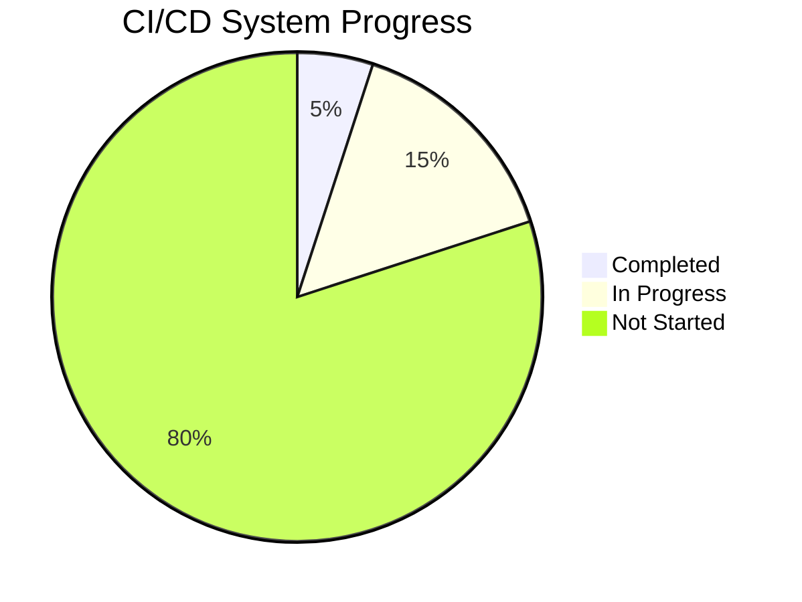
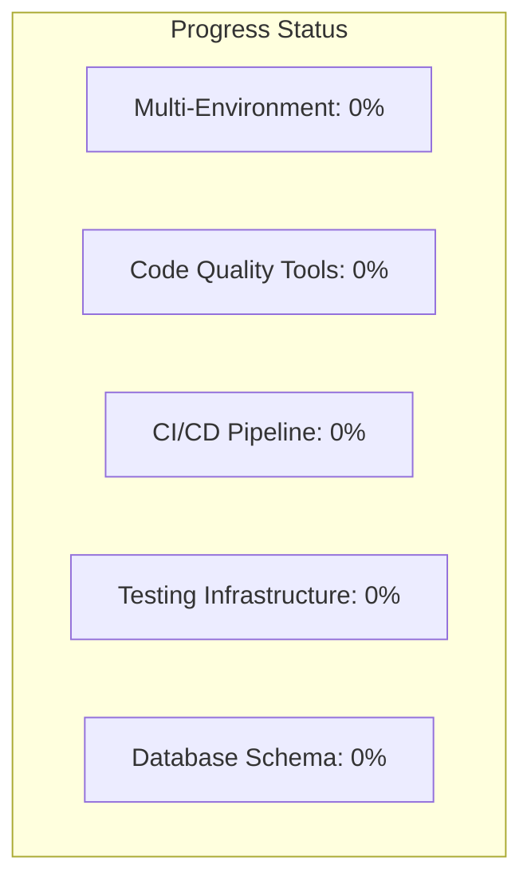
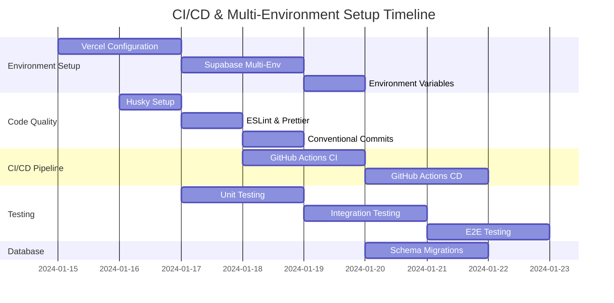
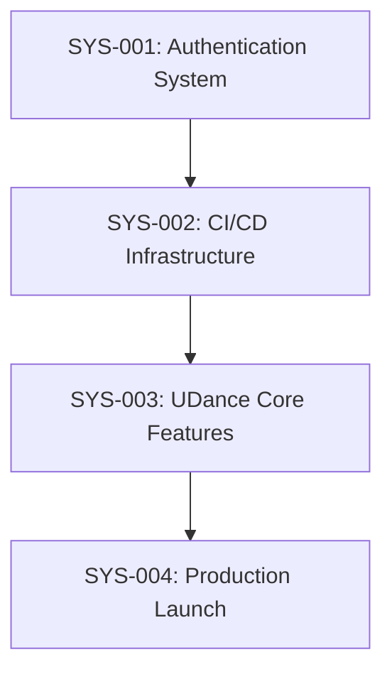

# Task: UDance Architecture Migration Implementation

## Description
Implement comprehensive authentication and API system for UDance platform migration from Cloudflare Workers to Next.js 15 + Supabase architecture.

## Complexity
**Level**: 4 - Complex System
**Type**: Architectural Migration + Full System Implementation
**Justification**: 
- Multiple external integrations (Google OAuth, Supabase, Vercel)
- Complete architectural restructuring
- CI/CD infrastructure setup
- Cross-platform considerations
- Security-critical authentication implementation

## Technology Stack
- **Framework**: Next.js 15 + React 19
- **Database**: Supabase (PostgreSQL)
- **Authentication**: Supabase Auth + Google OAuth
- **State Management**: Zustand
- **Styling**: Tailwind CSS 4
- **Deployment**: Vercel
- **CI/CD**: GitHub Actions
- **Language**: TypeScript

## Technology Validation Checkpoints
- [x] Next.js 15 project builds successfully
- [x] Supabase connection established
- [x] Google OAuth app configured
- [x] Vercel deployment pipeline working
- [x] TypeScript compilation passing
- [x] All dependencies compatible

## ACTIVE SYSTEMS
- [SYS-001]: Authentication System - ✅ COMPLETED
- [SYS-002]: CI/CD & Multi-Environment Infrastructure - 🎯 IN PROGRESS

## SYSTEM DETAILS

### [SYS-001]: Authentication System - ✅ COMPLETED

#### Status Summary
- **Status**: ✅ COMPLETED
- **Progress**: 100%
- **Completion Date**: Current Session
- **Key Achievement**: Google OAuth authentication fully functional

#### Completed Components
- [x] Supabase Auth integration
- [x] Google OAuth configuration
- [x] Environment variables setup
- [x] Authentication flow working
- [x] Protected routes middleware

---

### [SYS-002]: CI/CD & Multi-Environment Infrastructure

#### System Overview
- **Purpose**: Establish robust CI/CD pipeline with development, staging, and production environments
- **Architectural Alignment**: Supports scalable deployment, quality gates, and development workflow
- **Status**: 🎯 IN PROGRESS - PLANNING PHASE
- **Overall Progress**: 5%
- **Estimated Duration**: 1-2 weeks

#### System Milestones
- **MILE-001**: Environment Structure Setup - Target: Day 1-2 - Status: NOT STARTED
- **MILE-002**: Code Quality Tools (Husky + ESLint) - Target: Day 2-3 - Status: NOT STARTED  
- **MILE-003**: GitHub Actions CI/CD Pipeline - Target: Day 3-5 - Status: NOT STARTED
- **MILE-004**: Testing Infrastructure (Unit/Integration/E2E) - Target: Day 4-6 - Status: NOT STARTED
- **MILE-005**: Database Schema & Migrations - Target: Day 5-7 - Status: NOT STARTED
- **MILE-006**: Full System Integration Test - Target: Day 7-8 - Status: NOT STARTED

### Components

#### [COMP-001]: Multi-Environment Setup
- **Purpose**: Configure development, staging, and production environments
- **Status**: NOT STARTED
- **Dependencies**: None
- **Responsible**: Development Team
- **Priority**: CRITICAL

##### [FEAT-001]: Vercel Environment Configuration
- **Description**: Configure three environments in Vercel with proper branch mapping
- **Status**: NOT STARTED
- **Priority**: Critical
- **Related Requirements**: REQ-ENV-001, REQ-ENV-002
- **Quality Criteria**: All three environments deployable and accessible
- **Progress**: 0%

###### [TASK-001]: Setup Vercel Projects
- **Description**: Create three Vercel projects for dev/staging/prod
- **Status**: TODO
- **Estimated Effort**: 2 hours
- **Dependencies**: None
- **Risk Assessment**: Low - Standard Vercel configuration
- **Quality Gates**: Environments accessible via URLs

**Subtasks**:
- [ ] [SUB-001]: Create development environment (dev branch) - TODO
- [ ] [SUB-002]: Create staging environment (develop branch) - TODO  
- [ ] [SUB-003]: Configure production environment (main branch) - TODO
- [ ] [SUB-004]: Set up custom domains for staging/prod - TODO

###### [TASK-002]: Environment Variables Configuration
- **Description**: Configure environment-specific variables for each environment
- **Status**: TODO
- **Estimated Effort**: 3 hours
- **Dependencies**: TASK-001
- **Risk Assessment**: Medium - Requires careful secret management
- **Quality Gates**: All environments have correct variables

**Subtasks**:
- [ ] [SUB-005]: Create dev environment variables - TODO
- [ ] [SUB-006]: Create staging environment variables - TODO
- [ ] [SUB-007]: Create production environment variables - TODO
- [ ] [SUB-008]: Test variable accessibility in each environment - TODO

##### [FEAT-002]: Supabase Multi-Environment Setup
- **Description**: Create separate Supabase projects for dev/staging/prod
- **Status**: NOT STARTED
- **Priority**: Critical
- **Related Requirements**: REQ-DB-001, REQ-DB-002
- **Quality Criteria**: Isolated databases per environment
- **Progress**: 0%

###### [TASK-003]: Create Supabase Projects
- **Description**: Set up three Supabase projects for different environments
- **Status**: TODO
- **Estimated Effort**: 2 hours
- **Dependencies**: None
- **Risk Assessment**: Low - Standard Supabase setup
- **Quality Gates**: Three functioning Supabase projects

**Subtasks**:
- [ ] [SUB-009]: Create development Supabase project - TODO
- [ ] [SUB-010]: Create staging Supabase project - TODO
- [ ] [SUB-011]: Create production Supabase project - TODO
- [ ] [SUB-012]: Configure Google OAuth for each project - TODO

#### [COMP-002]: Code Quality & Development Tools
- **Purpose**: Implement development workflow with quality gates
- **Status**: NOT STARTED
- **Dependencies**: COMP-001
- **Responsible**: Development Team
- **Priority**: HIGH

##### [FEAT-003]: Husky Git Hooks Setup
- **Description**: Configure git hooks for pre-commit and pre-push quality checks
- **Status**: NOT STARTED
- **Priority**: High
- **Related Requirements**: REQ-QUA-001, REQ-QUA-002
- **Quality Criteria**: All commits pass quality gates
- **Progress**: 0%

###### [TASK-004]: Install and Configure Husky
- **Description**: Set up Husky with pre-commit and pre-push hooks
- **Status**: TODO
- **Estimated Effort**: 3 hours
- **Dependencies**: None
- **Risk Assessment**: Low - Standard tool setup
- **Quality Gates**: Hooks prevent bad commits

**Subtasks**:
- [ ] [SUB-013]: Install Husky and dependencies - TODO
- [ ] [SUB-014]: Configure pre-commit hook (ESLint + Prettier) - TODO
- [ ] [SUB-015]: Configure pre-push hook (tests + build) - TODO
- [ ] [SUB-016]: Configure commit-msg hook (conventional commits) - TODO

##### [FEAT-004]: ESLint & Prettier Configuration
- **Description**: Set up comprehensive linting and formatting rules
- **Status**: NOT STARTED
- **Priority**: High
- **Related Requirements**: REQ-QUA-003
- **Quality Criteria**: Consistent code style across project
- **Progress**: 0%

###### [TASK-005]: Configure ESLint Rules
- **Description**: Set up ESLint with React, Next.js, and TypeScript rules
- **Status**: TODO
- **Estimated Effort**: 2 hours
- **Dependencies**: None
- **Risk Assessment**: Low - Standard configuration
- **Quality Gates**: No linting errors in codebase

**Subtasks**:
- [ ] [SUB-017]: Install ESLint and related plugins - TODO
- [ ] [SUB-018]: Configure .eslintrc.json with Next.js rules - TODO
- [ ] [SUB-019]: Configure Prettier integration - TODO
- [ ] [SUB-020]: Add lint-staged for optimal performance - TODO

##### [FEAT-005]: Conventional Commits Setup
- **Description**: Implement conventional commits with Commitizen
- **Status**: NOT STARTED
- **Priority**: Medium
- **Related Requirements**: REQ-QUA-004
- **Quality Criteria**: All commits follow conventional format
- **Progress**: 0%

###### [TASK-006]: Setup Commitizen
- **Description**: Configure Commitizen for consistent commit messages
- **Status**: TODO
- **Estimated Effort**: 1.5 hours
- **Dependencies**: TASK-004
- **Risk Assessment**: Low - Standard tool
- **Quality Gates**: Commits follow conventional format

**Subtasks**:
- [ ] [SUB-021]: Install Commitizen and adapter - TODO
- [ ] [SUB-022]: Configure .cz.json with project-specific types - TODO
- [ ] [SUB-023]: Add npm script for guided commits - TODO
- [ ] [SUB-024]: Document commit conventions in README - TODO

#### [COMP-003]: GitHub Actions CI/CD Pipeline
- **Purpose**: Automated testing, building, and deployment pipeline
- **Status**: NOT STARTED
- **Dependencies**: COMP-001, COMP-002
- **Responsible**: Development Team
- **Priority**: CRITICAL

##### [FEAT-006]: Continuous Integration Pipeline
- **Description**: Automated testing and quality checks on pull requests
- **Status**: NOT STARTED
- **Priority**: Critical
- **Related Requirements**: REQ-CI-001, REQ-CI-002
- **Quality Criteria**: All PRs pass automated checks
- **Progress**: 0%

###### [TASK-007]: Create CI Workflow
- **Description**: GitHub Actions workflow for CI on pull requests
- **Status**: TODO
- **Estimated Effort**: 4 hours
- **Dependencies**: TASK-004, TASK-005
- **Risk Assessment**: Medium - Complex workflow configuration
- **Quality Gates**: PR checks pass before merge

**Subtasks**:
- [ ] [SUB-025]: Create .github/workflows/ci.yml - TODO
- [ ] [SUB-026]: Configure Node.js setup and caching - TODO
- [ ] [SUB-027]: Add TypeScript compilation check - TODO
- [ ] [SUB-028]: Add ESLint and Prettier checks - TODO
- [ ] [SUB-029]: Add security scanning (npm audit) - TODO

##### [FEAT-007]: Continuous Deployment Pipeline
- **Description**: Automated deployment to staging and production
- **Status**: NOT STARTED
- **Priority**: Critical
- **Related Requirements**: REQ-CD-001, REQ-CD-002
- **Quality Criteria**: Successful automated deployments
- **Progress**: 0%

###### [TASK-008]: Create CD Workflow
- **Description**: GitHub Actions workflow for deployment automation
- **Status**: TODO
- **Estimated Effort**: 5 hours
- **Dependencies**: TASK-007, TASK-001
- **Risk Assessment**: High - Production deployment automation
- **Quality Gates**: Successful deployments with rollback capability

**Subtasks**:
- [ ] [SUB-030]: Create .github/workflows/deploy.yml - TODO
- [ ] [SUB-031]: Configure automatic staging deployment (develop branch) - TODO
- [ ] [SUB-032]: Configure manual production deployment (main branch) - TODO
- [ ] [SUB-033]: Add deployment verification checks - TODO
- [ ] [SUB-034]: Configure rollback mechanism - TODO

#### [COMP-004]: Testing Infrastructure
- **Purpose**: Comprehensive testing strategy with unit, integration, and E2E tests
- **Status**: NOT STARTED
- **Dependencies**: COMP-002
- **Responsible**: Development Team
- **Priority**: HIGH

##### [FEAT-008]: Unit Testing Setup
- **Description**: Jest and React Testing Library for unit tests
- **Status**: NOT STARTED
- **Priority**: High
- **Related Requirements**: REQ-TEST-001
- **Quality Criteria**: >80% code coverage for critical paths
- **Progress**: 0%

###### [TASK-009]: Configure Jest and RTL
- **Description**: Set up Jest with React Testing Library for component testing
- **Status**: TODO
- **Estimated Effort**: 3 hours
- **Dependencies**: None
- **Risk Assessment**: Low - Standard testing setup
- **Quality Gates**: Test suite runs and reports coverage

**Subtasks**:
- [ ] [SUB-035]: Install Jest and React Testing Library - TODO
- [ ] [SUB-036]: Configure jest.config.js for Next.js - TODO
- [ ] [SUB-037]: Create test utilities and setup files - TODO
- [ ] [SUB-038]: Add coverage reporting configuration - TODO

##### [FEAT-009]: Integration Testing Setup
- **Description**: API and database integration testing
- **Status**: NOT STARTED
- **Priority**: High
- **Related Requirements**: REQ-TEST-002
- **Quality Criteria**: All API endpoints covered by tests
- **Progress**: 0%

###### [TASK-010]: Setup Integration Tests
- **Description**: Configure testing for API routes and database operations
- **Status**: TODO
- **Estimated Effort**: 4 hours
- **Dependencies**: TASK-009, TASK-003
- **Risk Assessment**: Medium - Database mocking complexity
- **Quality Gates**: API tests pass with test database

**Subtasks**:
- [ ] [SUB-039]: Configure test database setup - TODO
- [ ] [SUB-040]: Create API testing utilities - TODO
- [ ] [SUB-041]: Add database seeding for tests - TODO
- [ ] [SUB-042]: Create sample integration tests - TODO

##### [FEAT-010]: End-to-End Testing Setup
- **Description**: Playwright for E2E testing of critical user flows
- **Status**: NOT STARTED
- **Priority**: Medium
- **Related Requirements**: REQ-TEST-003
- **Quality Criteria**: Critical user flows covered by E2E tests
- **Progress**: 0%

###### [TASK-011]: Configure Playwright
- **Description**: Set up Playwright for end-to-end testing
- **Status**: TODO
- **Estimated Effort**: 4 hours
- **Dependencies**: TASK-001
- **Risk Assessment**: Medium - E2E test complexity and maintenance
- **Quality Gates**: E2E tests run in CI/CD pipeline

**Subtasks**:
- [ ] [SUB-043]: Install and configure Playwright - TODO
- [ ] [SUB-044]: Create page object models - TODO
- [ ] [SUB-045]: Add authentication flow E2E test - TODO
- [ ] [SUB-046]: Configure E2E tests in CI pipeline - TODO

#### [COMP-005]: Database Schema & Migrations
- **Purpose**: Version-controlled database schema with migrations
- **Status**: NOT STARTED
- **Dependencies**: COMP-001, COMP-003
- **Responsible**: Development Team
- **Priority**: MEDIUM

##### [FEAT-011]: Schema Migration System
- **Description**: Database schema versioning and migration system
- **Status**: NOT STARTED
- **Priority**: Medium
- **Related Requirements**: REQ-DB-003, REQ-DB-004
- **Quality Criteria**: Schema changes deployable across environments
- **Progress**: 0%

###### [TASK-012]: Setup Migration System
- **Description**: Configure database migration system with Supabase
- **Status**: TODO
- **Estimated Effort**: 3 hours
- **Dependencies**: TASK-003
- **Risk Assessment**: Medium - Database migration complexity
- **Quality Gates**: Migrations work across all environments

**Subtasks**:
- [ ] [SUB-047]: Configure Supabase CLI for migrations - TODO
- [ ] [SUB-048]: Create initial schema migration - TODO
- [ ] [SUB-049]: Add seed data migrations - TODO
- [ ] [SUB-050]: Test migrations across environments - TODO

### System-Wide Tasks
- [ ] [SYS-TASK-001]: Documentation update for new CI/CD process - TODO
- [ ] [SYS-TASK-002]: Team training on new development workflow - TODO
- [ ] [SYS-TASK-003]: Performance benchmarking across environments - TODO

### Risks and Mitigations

#### High-Risk Items
- **RISK-001**: Complex GitHub Actions workflow configuration
  - **Probability**: Medium
  - **Impact**: High - Could delay deployment automation
  - **Mitigation**: Start with simple workflows, iterate incrementally
  - **Contingency**: Manual deployment process as fallback

- **RISK-002**: Environment variable management complexity
  - **Probability**: Medium  
  - **Impact**: Medium - Could cause deployment failures
  - **Mitigation**: Use standardized naming conventions, document thoroughly
  - **Contingency**: Emergency manual configuration process

#### Medium-Risk Items
- **RISK-003**: Test suite performance in CI/CD
  - **Probability**: High
  - **Impact**: Medium - Could slow development workflow
  - **Mitigation**: Optimize test parallelization, use test caching
  - **Contingency**: Reduce test scope if necessary

- **RISK-004**: Supabase project limits and costs
  - **Probability**: Low
  - **Impact**: Medium - Could require infrastructure changes
  - **Mitigation**: Monitor usage, plan scaling strategy
  - **Contingency**: Consolidate dev/staging if needed

### Dependencies Matrix

| Task ID | Depends On | Blocks | Type | Critical Path |
|---------|------------|--------|------|---------------|
| TASK-001 | - | TASK-002, TASK-008 | Technical | ✅ |
| TASK-002 | TASK-001 | TASK-008 | Technical | ✅ |
| TASK-003 | - | TASK-010, TASK-012 | Technical | ⚠️ |
| TASK-004 | - | TASK-005, TASK-007 | Technical | ✅ |
| TASK-005 | TASK-004 | TASK-007 | Technical | ✅ |
| TASK-006 | TASK-004 | - | Resource | ❌ |
| TASK-007 | TASK-004, TASK-005 | TASK-008 | Technical | ✅ |
| TASK-008 | TASK-001, TASK-002, TASK-007 | - | Technical | ✅ |
| TASK-009 | - | TASK-010 | Technical | ⚠️ |
| TASK-010 | TASK-009, TASK-003 | - | Technical | ❌ |
| TASK-011 | TASK-001 | - | Technical | ❌ |
| TASK-012 | TASK-003 | - | Technical | ❌ |

**Legend**: ✅ Critical Path | ⚠️ Important | ❌ Non-Critical

### Progress Visualization

#### Overall System Progress


#### Component Progress


#### Project Timeline


### Resource Allocation

| Resource | Component | Allocation % | Time Period |
|----------|-----------|--------------|-------------|
| Senior Developer | COMP-001, COMP-003 | 60% | Week 1-2 |
| Senior Developer | COMP-002, COMP-004 | 40% | Week 1-2 |
| Junior Developer | COMP-004, COMP-005 | 30% | Week 2 |
| DevOps Specialist | COMP-003 | 100% | Week 1 |

### Latest Updates
- **2024-01-XX**: System planning initiated, complexity assessment completed
- **2024-01-XX**: Task breakdown structure created with 12 major tasks
- **2024-01-XX**: Risk assessment completed, 4 major risks identified
- **2024-01-XX**: Dependencies mapped, critical path identified
- **2024-01-XX**: Timeline established: 1-2 week delivery target

---

## COMPLETED SYSTEMS
- [SYS-001]: Authentication System - Completed 2024-01-XX

## SYSTEM DEPENDENCIES


## RISK REGISTER
| Risk ID | Description | Probability | Impact | Mitigation | Status |
|---------|-------------|-------------|--------|------------|--------|
| RISK-001 | GitHub Actions complexity | Medium | High | Incremental implementation | Active |
| RISK-002 | Environment variables management | Medium | Medium | Standardized naming | Active |
| RISK-003 | CI/CD performance | High | Medium | Test optimization | Monitoring |
| RISK-004 | Supabase scaling costs | Low | Medium | Usage monitoring | Monitoring |

## RESOURCE ALLOCATION
| Resource | System | Allocation % | Time Period |
|----------|--------|--------------|-------------|
| Senior Developer | SYS-002 | 80% | Week 1-2 |
| Junior Developer | SYS-002 | 30% | Week 2 |
| DevOps Specialist | SYS-002 | 100% | Week 1 |

---

## System Architecture

### Architecture Overview
```
┌─────────────────┐    ┌─────────────────┐    ┌─────────────────┐
│   Client App    │────│   Next.js API   │────│   Supabase DB   │
│ (React/Zustand) │    │     Routes      │    │  (PostgreSQL)   │
└─────────────────┘    └─────────────────┘    └─────────────────┘
         │                       │                       │
         └───────────────────────┼───────────────────────┘
                        ┌─────────────────┐
                        │ Supabase Auth   │
                        │ (Google OAuth)  │
                        └─────────────────┘
```

## Status
- [x] Memory Bank initialized
- [x] Project context documented
- [x] Complexity determination complete (Level 4)
- [x] Implementation plan created
- [x] Technology validation performed
- [x] Authentication system implemented ✅
- [ ] CI/CD Infrastructure setup 🎯 IN PROGRESS
- [ ] Creative phases executed
- [ ] Full system implementation

## Implementation Plan

### Phase 1: External Services Setup (Week 1) ✅ COMPLETED
**Goal**: Configure all external services and integrations

#### 1.1 Supabase Project Setup ✅ COMPLETED
- [x] Create Supabase project
- [x] Configure database schema
- [x] Set up Row Level Security (RLS)
- [x] Generate TypeScript types
- [x] Configure environment variables

#### 1.2 Google OAuth Configuration ✅ COMPLETED
- [x] Create Google Cloud Console project
- [x] Configure OAuth consent screen
- [x] Generate OAuth credentials
- [x] Configure authorized redirect URIs
- [x] Test OAuth flow

#### 1.3 Vercel Account Setup ✅ COMPLETED
- [x] Create Vercel account
- [x] Connect GitHub repository
- [x] Configure environment variables
- [x] Test initial deployment

**Milestone**: External services configured and accessible ✅

### Phase 2: Authentication System (Week 1-2) ✅ COMPLETED
**Goal**: Implement complete authentication flow

#### 2.1 Supabase Auth Integration ✅ COMPLETED
- [x] Configure Supabase client
- [x] Set up authentication middleware
- [x] Create auth store with Zustand
- [x] Implement session management
- [x] Handle auth state persistence

#### 2.2 Google OAuth Implementation ✅ COMPLETED
- [x] Configure Google OAuth provider
- [x] Implement OAuth callback handling
- [x] Create login/logout components
- [x] Handle OAuth errors and edge cases
- [x] Test complete auth flow

#### 2.3 Route Protection ✅ COMPLETED
- [x] Create middleware for route protection
- [x] Implement protected route wrapper
- [x] Handle unauthorized access
- [x] Redirect logic after authentication
- [x] Test route protection

**Milestone**: Complete authentication system working ✅

### Phase 3: CI/CD Infrastructure (Week 2) 🎯 CURRENT PHASE
**Goal**: Establish robust development and deployment pipeline

#### 3.1 Multi-Environment Setup
- [ ] Configure Vercel environments (dev/staging/prod)
- [ ] Set up Supabase projects for each environment
- [ ] Configure environment-specific variables
- [ ] Test deployment to each environment

#### 3.2 Code Quality Pipeline
- [ ] Install and configure Husky git hooks
- [ ] Set up ESLint with Next.js/React rules
- [ ] Configure Prettier for code formatting
- [ ] Implement conventional commits with Commitizen
- [ ] Configure lint-staged for performance

#### 3.3 GitHub Actions CI/CD
- [ ] Create CI workflow for pull request validation
- [ ] Set up automated testing pipeline
- [ ] Configure security scanning
- [ ] Implement deployment automation
- [ ] Add deployment verification

#### 3.4 Testing Infrastructure
- [ ] Set up Jest and React Testing Library
- [ ] Configure integration testing
- [ ] Implement Playwright for E2E testing
- [ ] Add test coverage reporting
- [ ] Integrate tests into CI pipeline

**Milestone**: Complete CI/CD pipeline operational

### Phase 4: API Endpoints (Week 2-3) ⏳ PENDING
**Goal**: Create public and protected API endpoints

#### 4.1 Public API Development
- [ ] Create `/api/words` endpoint
- [ ] Implement word list functionality
- [ ] Add proper HTTP status codes
- [ ] Handle errors gracefully
- [ ] Add API documentation

#### 4.2 Protected API Development
- [ ] Create protected API routes
- [ ] Implement authentication middleware for APIs
- [ ] Create user-specific endpoints
- [ ] Add rate limiting
- [ ] Test API security

#### 4.3 Database Integration
- [ ] Create words table in Supabase
- [ ] Implement database queries
- [ ] Add data validation
- [ ] Implement CRUD operations
- [ ] Test database operations

**Milestone**: Public and protected APIs functional

### Phase 5: Dashboard Implementation (Week 3-4) ⏳ PENDING
**Goal**: Create protected dashboard with user-specific content

#### 5.1 Dashboard Layout
- [ ] Create dashboard layout component
- [ ] Implement navigation
- [ ] Add responsive design
- [ ] Create loading states
- [ ] Handle authentication states

#### 5.2 Dashboard Features
- [ ] User profile display
- [ ] Protected content rendering
- [ ] User-specific data fetching
- [ ] Dashboard navigation
- [ ] Logout functionality

#### 5.3 State Management
- [ ] Implement global state for user data
- [ ] Handle data synchronization
- [ ] Implement optimistic updates
- [ ] Handle offline states
- [ ] Test state management

**Milestone**: Dashboard accessible and functional

### Phase 6: Documentation Update (Week 4) ⏳ PENDING
**Goal**: Comprehensive documentation for new architecture

#### 6.1 Architecture Documentation
- [ ] Update system architecture docs
- [ ] Document API specifications
- [ ] Create deployment guides
- [ ] Update development workflow
- [ ] Document security considerations

#### 6.2 User Documentation
- [ ] Create user guides
- [ ] Document feature functionality
- [ ] Create troubleshooting guides
- [ ] Update README files
- [ ] Create developer onboarding guide

**Milestone**: Complete documentation available

## Recent Changes
- 2024-01-XX: Level 4 complexity determination completed
- 2024-01-XX: Comprehensive 6-phase implementation plan created
- 2024-01-XX: 3 creative phases identified requiring design decisions
- 2024-01-XX: Risk assessment and mitigation strategies documented
- 2024-01-XX: Technology stack validated and documented
- 2024-01-XX: Quality gates and success metrics defined
- 2024-01-XX: Authentication system successfully implemented ✅
- 2024-01-XX: CI/CD Infrastructure planning initiated 🎯

## Known Issues
- None currently identified for authentication system
- All major risks for CI/CD phase have documented mitigation strategies

## Dependencies Status
- ✅ **Supabase Account**: Configured and operational
- ✅ **Google OAuth App**: Configured and working
- ✅ **Vercel Account**: Setup and operational
- ✅ **Technical Stack**: All core technologies compatible
- ✅ **Development Environment**: Ready for implementation
- ⏳ **CI/CD Pipeline**: Planning in progress

## Next Milestones
1. **Multi-Environment Setup Complete**: All three environments operational
2. **Code Quality Pipeline**: Husky, ESLint, Prettier configured
3. **GitHub Actions Operational**: CI/CD pipeline working
4. **Testing Infrastructure**: All test types configured
5. **Database Schema**: Migration system operational

## Timeline Projection
- **Week 1**: ✅ Authentication system (COMPLETED)
- **Week 2**: 🎯 CI/CD Infrastructure setup (CURRENT)
- **Week 3**: ⏳ API development + Dashboard
- **Week 4**: ⏳ Documentation + final testing

**Current Status**: Phase 3 CI/CD Infrastructure - Planning Complete ✅ | Implementation Starting 🎯 